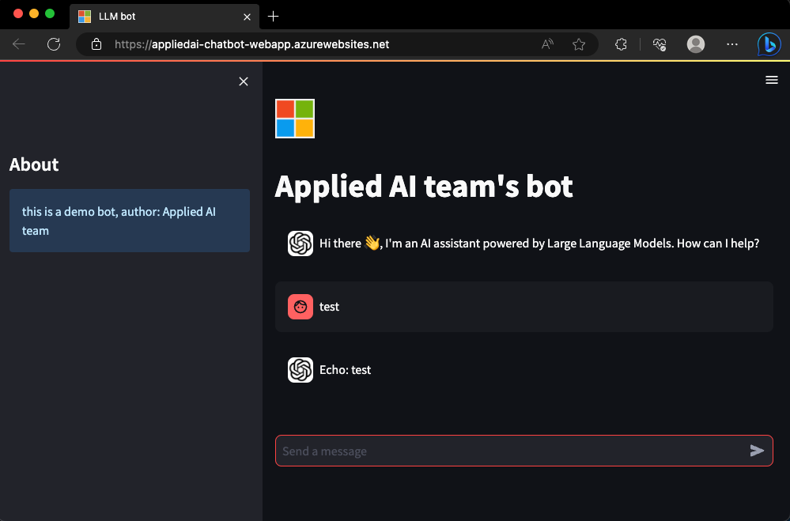

# Azure-streamlit-chatbot

---
A sample demonstrating how to deploy a streamlit-chatbot (LLM-powered) User Interface in Azure for demo purposes. This sample is in python and uses [Streamlit](https://streamlit.io/) + [Azure Container Registry (ACR)](https://azure.microsoft.com/en-us/products/container-registry) + [Azure Web App](https://azure.microsoft.com/en-us/products/app-service/containers?activetab=pivot:deploytab) to deploy a chat interface.




## Pre-requisites

1. Azure CLI install instructions [here](https://learn.microsoft.com/en-us/cli/azure/install-azure-cli)
2. Azure web app
3. Azure Container Registry

## Links

- https://docs.streamlit.io/knowledge-base/tutorials/build-conversational-apps
- https://towardsdatascience.com/deploying-a-streamlit-web-app-with-azure-app-service-1f09a2159743

## Folder structure

```bash
.
├── Dockerfile
├── README.md
├── environment.yml
└── streamlit_app
    ├── config.yaml
    ├── images
    ├── llm_bot.py
    ├── main.py
    └── requirements.txt
```

1. This sample can be run locally (without the need for containerization) or as a Docker container. To deploy to Azure, we build the container remotely using ACR and deploy using Web app.
2. The streamlit app is defined in a folder `streamlit_app/`  
   1. `main.py` is the main access point and contains the front-end
   2. `llm_bot.py` contains the chatbot response logic.
   3. `config.yml` containes all configurations such as title, logos etc.
3. `Dockerfile` and `environment.yml` define how the container should be built

## Usage

The sample can be run locally OR deployed to Azure web app as a Docker container.

1. **To run the streamlit app locally:**
   1. In a terminal `streamlit run ./streamlit_app/main.py --server.port 8000`
   2. open a web browser at `localhost:8000`
2. **To deploy to Azure web app as a Docker container**
   1. *Optional* if already setup: Create the ACR and web-app services. Note: any of the `<ACR-name>, <RG-name>, etc. are arbitrarily defined`
      1. Ensure you are creating [your services on the correct subscription](https://learn.microsoft.com/en-us/cli/azure/manage-azure-subscriptions-azure-cli)
         1. `az account list --output table` to list all subscriptions available to you
         2. `az account show --output table` to show which subscription is currently set to
         3. `az account set --subscription "xxxxxxxx-xxxx-xxxx-xxxx-xxxxxxxxxxxx"` to set a subsrciption using a subscription-id
      2. Create a container registry ` az acr create --name <ACR-NAME> --resource-group <RG-NAME> --sku basic --admin-enabled true`
      3. Create a web app service plan `az appservice plan create --resource-group <RG-NAME> --name <APP-SERVICE-PLAN-NAME> --location eastus --is-linux --sku B1` (note: B1 sku is needed for websockets - required by streamlit)
   2. Build the docker container remotely (this will upload and build the container in your ACR service) `az acr build --registry <ACR-NAME> --resource-group <RG-NAME> --image bot .`
   3. Create a web app using the built container `az webapp create --resource-group <RG-NAME> --plan <APP-SERVICE-PLAN-NAME> --name <BOT-WEBAPP-NAME> -i <ACR-NAME>.azurecr.io/bot:latest`
   4. Configure your web app to listen to port 8000 and set a longer container_start_time_limit `az webapp config appsettings set --resource-group <RG-NAME> --name <BOT-WEBAPP-NAME> --settings WEBSITES_PORT=8000 WEBSITES_CONTAINER_START_TIME_LIMIT=1800 `
   5. Open a browser at `<BOT-WEBAPP-NAME>.azurewebsites.net` (note: it may take a few minutes to load the first time the container is started)

3.  **Optional: Build and run Docker container locally** (requires [docker installed locally](https://docs.docker.com/engine/install/))
    1. build the docker container `docker build -t bot:v1 .`
    2. run the docker container locally `docker run --rm -p 8000:8000 bot:v1`
    3. open a web browser and type `localhost:8000`

## Updating & troubleshooting:

In order to redeploy the bot, all you need to do is rebuild a container on ACR, and recreate the web app (you can reuse the same webapp previously created)

1. Re-Build the docker container remotely (this will upload and build the container in your ACR service) `az acr build --registry <ACR-NAME> --resource-group <RG-NAME> --image bot .`
2. Re-create a web app `az webapp create -g <RG-NAME> -p <APP-SERVICE-PLAN-NAME> -n <BOT-WEBAPP-NAME> -i <ACR-NAME>.azurecr.io/bot:latest `
3. Container logs can be handy fro troubleshooting, link on how to access [these](https://stackoverflow.com/questions/52245077/where-can-i-find-docker-container-logs-for-azure-app-service) in the web app on portal.azure.com (look for `log stream on the left`)